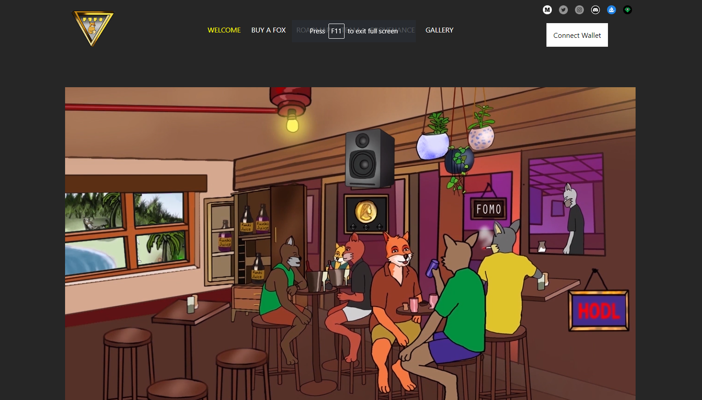
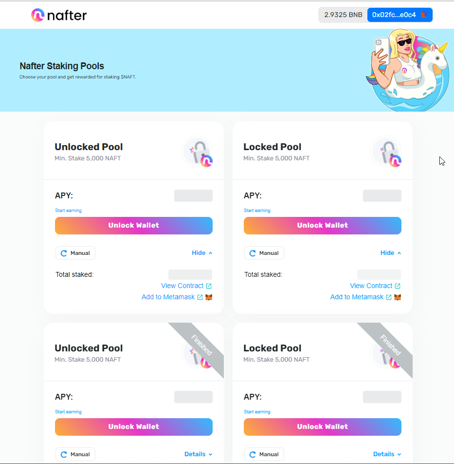

 ## A passionate blockchain & fullstack developer

<!--   &nbsp;&nbsp; -->
<!--   &nbsp;&nbsp; -->
<!--   &nbsp;&nbsp; -->

  

I am currently working remotely.

❤️ **I'm passionate about:**

I am Full Stack & Blockchain developer
 I have 6+ years of experience writing Full Stack web apps that span consumer productivity software to mission-critical financial trading platforms. I have extensive knowledge of smart contract, front-end JavaScript and browser APIs as well as significant experience with popular frameworks and libraries like React and Redux. As a full stack developer, my main programming language is Javascript, Solidty, PHP, Python. I have good experience with ❤️Next.js❤️, Solidity, Web3, ❤️React.js❤️, Ethers, Python, Openzepplin. Particularly Recat and Vue is my ❤️ framework and also I have rich experenice on React Framework(MERN), Truffle. Including framwork that said above, I have done 10+ web site with MERN, Nuxt, Next, Web3, Ethers.

I have also strong technical understanding of various machine learning algorithms, including Neural networks and Deep learning.
### About Me
### My Skills

<table>
  <tr>
    <td></td>
      <td></td>
      <td></td>
      <td></td>
      <td></td>
      <td></td>
      <td></td>
      <td></td>
      <td></td>
      <td></td>
      <td></td>
      <td></td>
    </tr>
</table>

### DeFi Experiences
#### NFT Mint Dapps
##### [Funkiverse](https://funkifoxes.com/)
 

#### NFT Marketplaces
##### [Pocoland](https://pocoland.com/nft-market)

#### Staking
##### [Nafter](https://staking.nafter.io)
  
 
#### Defi, NFT Staking, NFT Marketplace
 

  <a href='https://dex.treedefi.com/' target='_blank'>
  </img>
  </a>
  <a href='https://nft.treedefi.com/' target='_blank'>
  </img>
  </a>
  <a href='https://nft.treedefi.com/merchandise' target='_blank'>
  </img>
  </a>

##### [EggPlant NFT Mint on Ethereum](https://eggplantnftmint.netlify.app/)
<a href='https://eggplantnftmint.netlify.app/'>
</img>
</a>

- [NFT Contract](https://rinkeby.etherscan.io/address/0x5098016A35851F6115816863f436dc3e85d999ED#code)
- [Main Mint Frontend](https://github.com/ernestpapyan/EggPlant-NFT-Mint-App)

