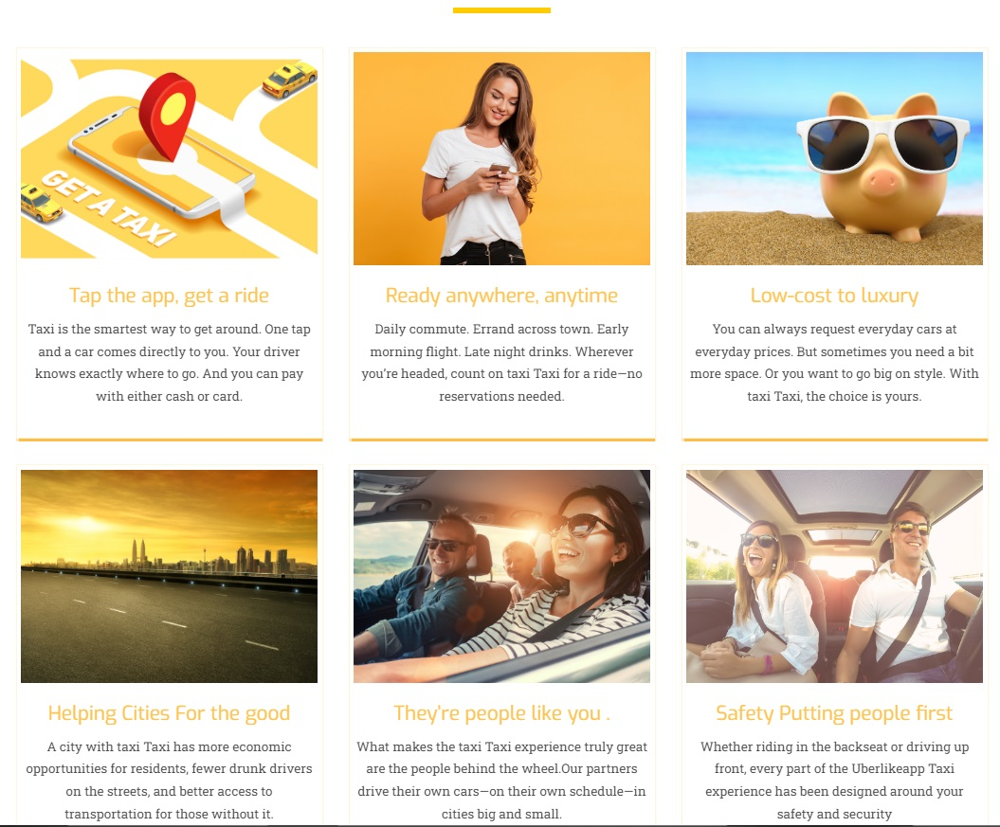
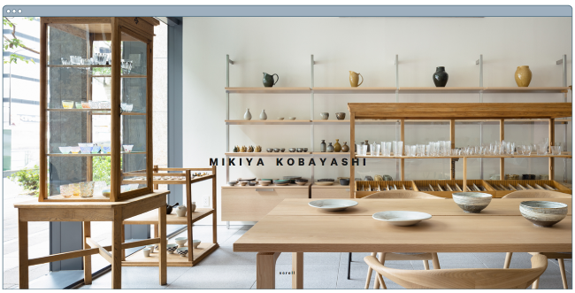
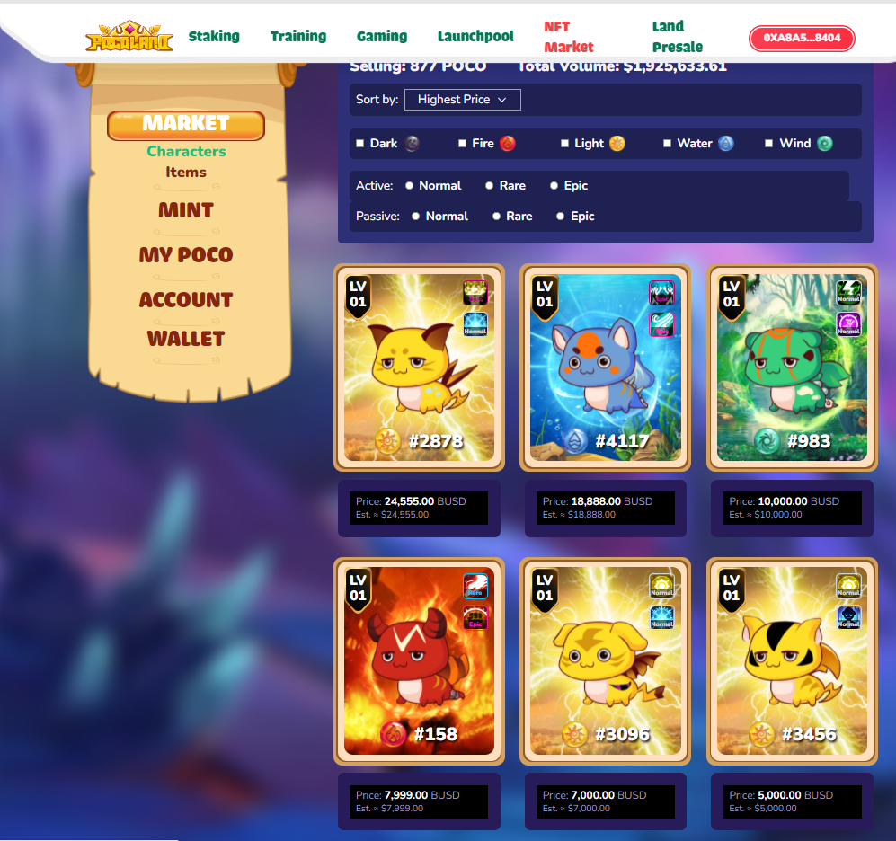
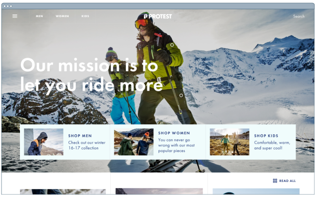

 ## Full Stack Web && Flutter App Developer

 
 
### :woman_technologist: &nbsp;About Me :

I am a Full Stack and flutter app dev.  

- ⚡ I am currently working remotely.
- 🔭 I’m working as a Software Engineer and contributing to frontend and backend for building web and mobile app applications.
- 🌱 Exploring Technical Content Writing.

---

### 🛠 &nbsp;Languages and Tools :

&nbsp;
&nbsp;
&nbsp;
&nbsp;
&nbsp;
&nbsp;
&nbsp;
&nbsp;
&nbsp;
&nbsp;
&nbsp;
&nbsp;
&nbsp;
&nbsp;
&nbsp;
&nbsp;

---

❤️ **I'm passionate about:**

I am Full Stack & Mobile App developer
  I have 6+ years of experience writing Full Stack web sites and flutter mobile applications. 
  As a full stack developer, my main programming language is Javascript, Solidty, PHP, Python. I have good experience with ❤️Next.js❤️, Solidity, Web3, ❤️React.js❤️. 
  Particularly React and Vue is my ❤️ framework and also I have rich experenice on express and laravel backend. 

---

#### Vue.js 
##### [Online-Shopping](http://www.mikiyakobayashi.com/)

  

#### Frontend Design(NFT Marketplaces) 
##### [Pocoland](https://pocoland.com/nft-market)

#### MERN stack 
##### [Online-shopping(clothes)](https://www.protest.eu/)

  

#### Frontend Design(Defi, NFT Staking, NFT Marketplace)
 

  <a href='https://dex.treedefi.com/' target='_blank'>
  </img>
  </a>
  <a href='https://nft.treedefi.com/' target='_blank'>
  </img>
  </a>
  <a href='https://nft.treedefi.com/merchandise' target='_blank'>
  </img>
  </a>

